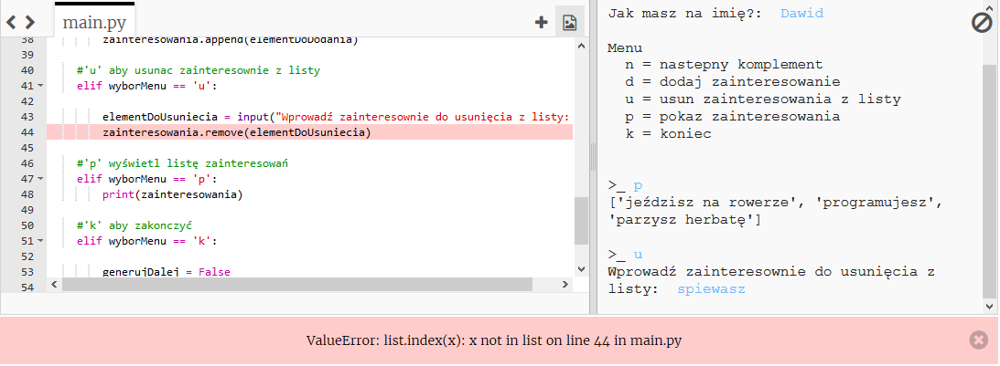
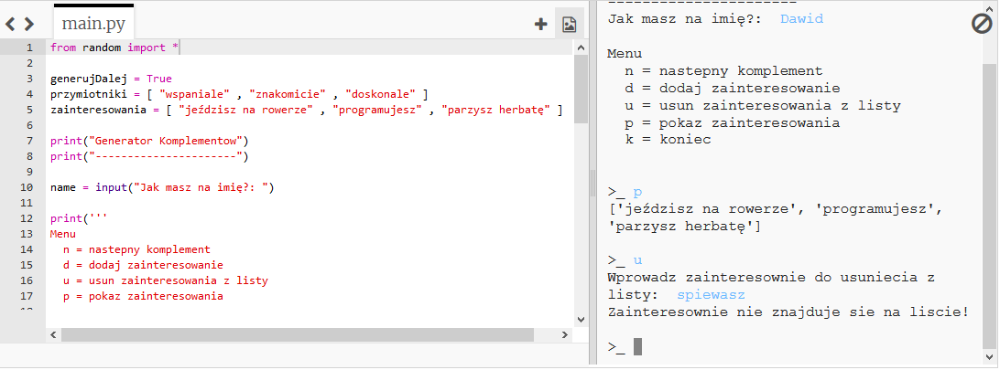
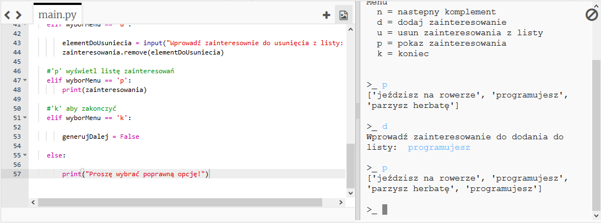
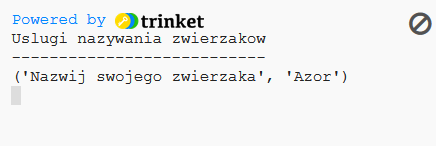

---
title: Generator Komplementów
level: Python 1
language: pl
stylesheet: python
embeds: "*.png"
materials: ["Project Resources/*.*","Club Leader Resources/*.*"]
...

#Wprowadzenie:  { .intro}

Nauczymy się korzystać z list, aby zapisywać wiele danych w jednej zmiennej.

#Step 1: Miło jest być miłym { .activity}

W tym projekcie napiszesz program, który będzie wyświetlał użytkownikowi losowy komplement!

## Lista zadań { .check}

+ Do tej pory w projektach korzystaliśmy ze zmiennych aby zapisać pojedynczą informację, taką jak imię lub ilość punktów. Co, jeśli chcielibyśmy zapisać większą ilość informacji? W Pythonie można użyć _listy_ do zapisania większej ilości danych w jednej zmiennej:

    ```python
    duzePlanety = [ "jowisz" , "saturn" , "uran" , "neptun"]
    ```

    Ta lista teksu jest również znana pod nazwą _tablica_ tekstu (po angielsku _array_). Aby uzyskać dostęp do konkretnej wartości, wystarczy znać jej pozycję w tablicy. Uruchom poniższy program żeby lepiej zrozumieć, jak działają listy:

    ```python
    duzePlanety = [ "jowisz" , "saturn" , "uran" , "neptun"]
    print( duzePlanety )
    print( duzePlanety[0] )
    print( duzePlanety[1] )
    print( duzePlanety[2] )
    print( duzePlanety[3] )
    ```

    

    Jak widzisz, pozycje zaczynają się od 0 a nie od 1, dlatego `duzePlanety[1]` to "saturn" (drugi element) a nie "jowisz".

+ Możesz skorzystać z listy `komplementy` do zapisania wszystkich możliwych komplementów do twojego generatora komplementów, a potem użyć `choise(komplementy)` do wybrania losowego komplementu dla użytkownika:

    ```python
    from random import *

    print("Generator Komplementow")
    print("----------------------")

    komplementy = [ "Wykonałeś świetną robotę. Naprawdę super." ,
                    "Programowanie idzie Ci znakomicie." ,
                    "Jesteś wspaniałym człowiekiem."
                  ]

    #wyswietl losowy element z listy 'komplementy'
    print(choice(komplementy))
    print("Proszę bardzo!")
    ```

    

+ Możesz sprawić, że Twoje komplementy będą odrobinę bardziej interesujące dzięki połączeniu elementów 2 różnych list:

    ```python
    from random import *

    print("Generator Komplementow")
    print("----------------------")

    przymiotniki = [ "wspaniale" , "znakomicie" , "doskonale" ]
    zainteresowania = [ "jeździsz na rowerze" , "programujesz" , "parzysz herbatę" ]

    imie = input("Jak masz na imię?: ")
    print( "Oto Twój komplement" , imie , ":" )

    #pobierz dowolny element z obu list i połącz je w komplement
    print( imie , choice(przymiotniki) , choice(zainteresowania) )
    print( "Proszę bardzo!" )
    ```

    

## Zapisz Swój Projekt {.save}

## Wyzwanie: Dodanie większej ilości komplementów { .challenge}
Spróbuj wymyślić więcej komplementów i dodaj je do programu! Pamiętaj, że musisz dodać przecinek (`,`) pomiędzy elementami na twojej liście.

## Zapisz Swój Projekt {.save}

#Krok 2: Niekończące się komplementy { .activity}

## Lista zadań { .check}

+ Wykorzystując to, co wiesz o pętlach `while` i warunkach `if`, możesz zmienić program w taki sposób, żeby prawił komplementy do momentu, kiedy użytkownik nie zdecyduje, aby przestał:

    ```python
    from random import *

    #program jest zapętlony tak długo, jak ta zmienna jest 'True'
    generujDalej = True

    przymiotniki = [ "wspaniale" , "znakomicie" , "doskonale" ]
    zainteresowania = [ "jeździsz na rowerze" , "programujesz" , "parzysz herbatę" ]

    print("Generator Komplementow")
    print("----------------------")

    name = input("Jak masz na imię?: ")

    print('''
    Menu
      n = nastepny komplement
      k = koniec
    ''')

    while generujDalej == True:

        wyborMenu = input("\n>_").lower()

        #'n' aby wygenerowac nowy komplement
        if wyborMenu == 'n':

            print( "Oto twoj komplement" , name , ":" )

            #pobierz losowe elementy z dwoch list i polacz je w komplement
            print( name , choice(przymiotniki) , choice(zainteresowania) )
            print( "Prosze bardzo!" )

        #'k' aby zakonczyc
        elif wyborMenu == 'k':

            generujDalej = False

        else:

            print("Proszę wybrać poprawną opcję!")
    ```

    

    Pamiętaj, że pętla `while` będzie trwała tak długo, aż zmienna `generujDalej` będzie ustawiona na `True`. Kiedy użytkownik wybierze `k`, `generujDalej` jest ustawione na `False`.

## Zapisz Swój Projekt {.save}

#Krok 3: Dopasowanie komplementów { .activity}

## Lista zadań { .check}

+ Twój generator komplementów zaczyna wyglądać porządnie, ale jest jeden problem: co, jeśli użytkownik nie potrafi jeździć na rowerze ani parzyć herbaty? W takim przypadku komplementy nie będą prawdziwe i nie podniosą go na duchu!

    Zmodyfikujmy Twój program w taki sposób, aby użytkownik mógł zmieniać zawartość listy `zainteresowania` i dopasować do siebie komplementy, które otrzymuje:

    ```python
    from random import *

    generujDalej = True
    przymiotniki = [ "wspaniale" , "znakomicie" , "doskonale" ]
    zainteresowania = [ "jeździsz na rowerze" , "programujesz" , "parzysz herbatę" ]

    print("Generator Komplementow")
    print("----------------------")

    name = input("Jak masz na imię?: ")

    print('''
    Menu
      n = nastepny komplement
      d = dodaj zainteresowanie
      u = usun zainteresowania z listy
      p = pokaz zainteresowania
      k = koniec
    ''')

    while generujDalej == True:

        wyborMenu = input("\n>_").lower()

        #'n' aby wygenerowac nowy komplement
        if wyborMenu == 'n':

            print( "Oto Twój komplement" , name , ":" )

            #pobierz losowe elementy z dwoch list i polacz je w komplement
            print( name , choice(przymiotniki) , choice(zainteresowania) )
            print( "Prosze bardzo!" )

        #'d' aby dodac zainteresowanie
        elif wyborMenu == 'd':

            elementDoDodania = input("Wprowadź zainteresowanie do dodania do listy: ")
            zainteresowania.append(elementDoDodania)

        #'u' aby usunac zainteresownie z listy
        elif wyborMenu == 'u':

            elementDoUsuniecia = input("Wprowadź zainteresownie do usunięcia z listy: ")
            zainteresowania.remove(elementDoUsuniecia)

        #'p' wyświetl listę zainteresowań
        elif wyborMenu == 'p':
            print(zainteresowania)

        #'k' aby zakonczyć
        elif wyborMenu == 'k':

            generujDalej = False

        else:

            print("Proszę wybrać poprawną opcję!")
    ```

    Jak widzisz, można używać `append()` do dodawania elementów do listy i `remove()` do ich kasownia. Uruchom ten program i dopasuj zainteresowania do Twoich potrzeb. Proś program o komplementy, aż poprawi Ci się humor!

+ Czy podczas testowania powyższego programu pojawiły się jakieś problemy? W tej chwili, Twój program zawiesza się, kiedy próbujesz usunąć element, który nie jest na liście:

    

    Można to naprawić, sprawdzając najpierw, czy element który chcesz usunąć jest już na liście. Podmień kod usuwający zainteresowanie na taki:

    ```python
        #'u' aby usunac zainteresownie z listy
        elif wyborMenu == 'u':

            elementDoUsuniecia = input("Wprowadz zainteresownie do usuniecia z listy: ")
            #usun element tylko wtedy kiedy znajduje sie na liscie
            if elementDoUsuniecia in zainteresowania:
            	zainteresowania.remove(elementDoUsuniecia)
            else:
            	print("Zainteresownie nie znajduje sie na liscie!")
    ```

    Uruchom program i spróbuj usunąć zainteresowanie z poza listy:

    

## Zapisz Swój Projekt {.save}

## Wyzwanie: Powtarzające się zainteresowania { .challenge}
Innym problemem jest to, że możliwe jest dodanie kilku takich samych zainteresowań:



Czy umiesz naprawić ten problem w taki sposób, aby można było dodać zainteresowanie tylko, jeśli nie ma go jeszcze na liście:

```python
if elementDoDodania not in zainteresowania:
	#dodaj tutaj swoj kod...
```

## Zapisz Swój Projekt {.save}

## Wyzwanie: Usługa nazywania zwierzaków { .challenge}
Napisz program, który pomoże właścicielom nazywać ich podopiecznych:



Twój program może:
+ pozwalać użytkownikowi dodawać i usuwać imiona z listy;
+ nadawać różne imiona chłopcom i dziewczynkom albo różnym gatunkom zwierząt;
+ zapytać użytkownika, ile imion będzie im potrzebne, na wypadek gdyby mieli kilka zwierząt.

## Zapisz Swój Projekt {.save}