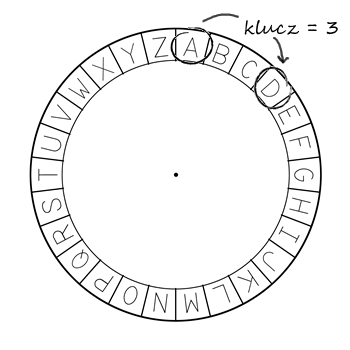
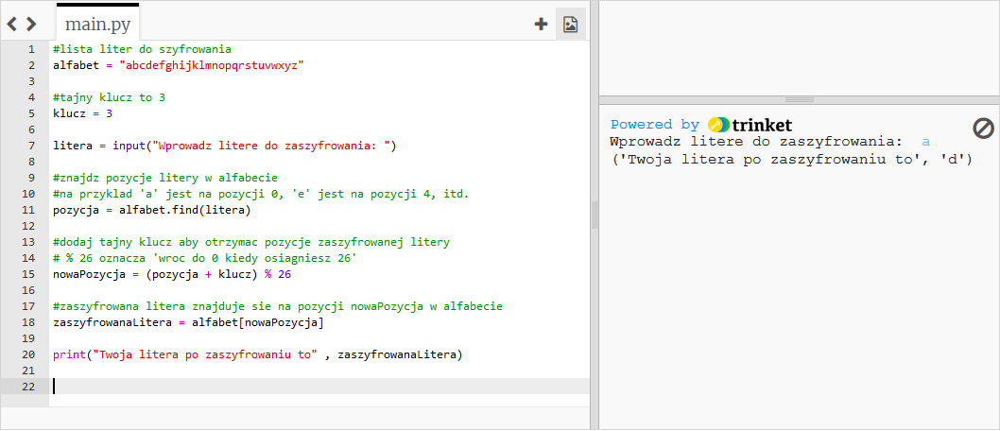
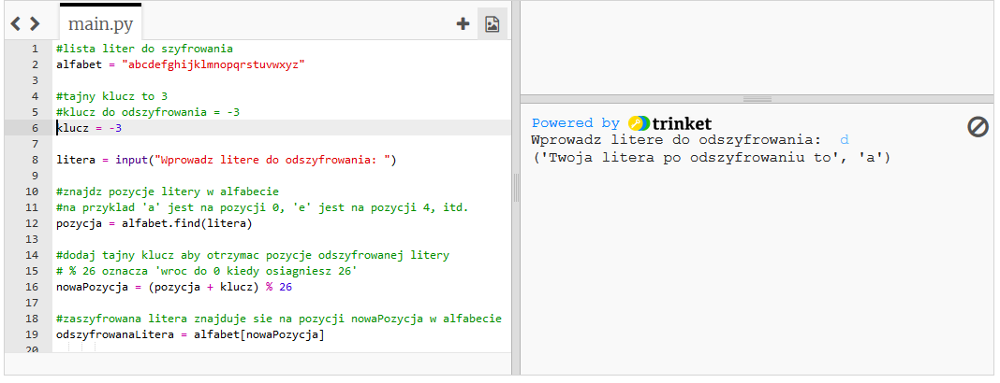
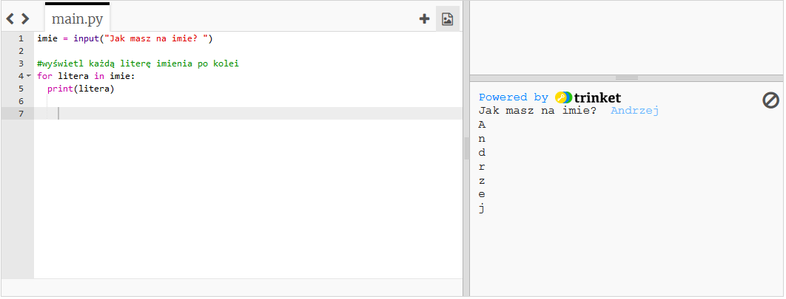
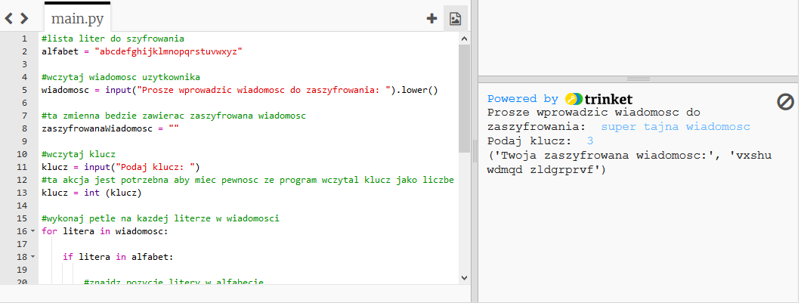
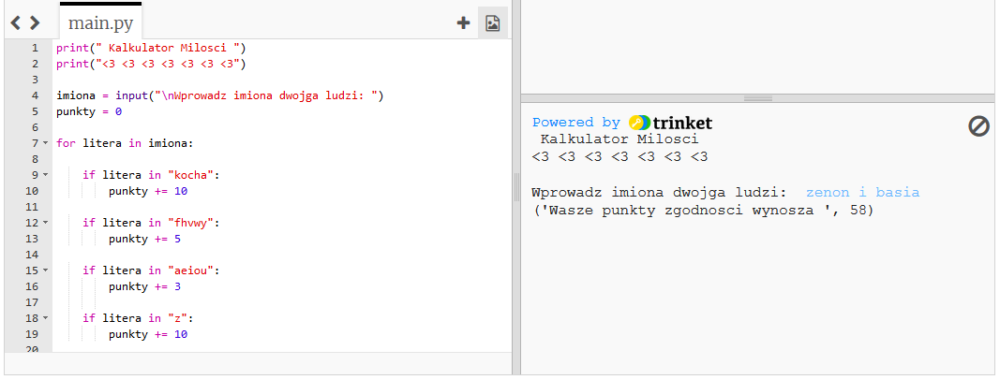

---
title: Sekretne Wiadomości
level: Python 2
language: pl
stylesheet: python
embeds: "*.png"
materials: ["Project Resources/*.*","Club Leader Resources/*.*"]
...

#Wprowadzenie:  { .intro}
W tym projekcie nauczysz się jak napisać swój własny program szyfrujący, którym będzie można wysyłać tajne wiadomości do przyjaciół.

#Krok 1: Szyfrowanie liter { .activity}

Szyfrowanie jest typem tajnego kodu, w którym zamienia się litery tak, aby nikt niepożądany nie mógł odczytać wiadomości. Będziemy używać najstarszej i najbardziej znanej metody szyfrowania, szyfru Cezara, którego nazwa pochodzi od gościa, który nazywał się Juliusz Cezar.

Zaczyna się od narysowania liter w kole, jak poniżej:


Aby uzyskać zaszyfrowaną literę, musisz posiadać tajny klucz. W naszym przykładzie użyjmy cyfry 3. Aby zakodować literę "a" po prostu przesuwasz 3 litery zgodnie z kierunkiem wskazówek zegara, co daje literę "d":



Aby odszyfrować wiadomość trzeba każdą literę przesunąć z powrotem o 3 miejsca, w przeciwnym kierunku.

## Lista zadań { .check}

+ Zacznijmy od napisania programu do szyfrowania liter. Uruchom poniższy program i sprawdź czy działa, gdy wpiszesz literę "a":

	```python
	# lista liter do szyfrowania
	alfabet = "abcdefghijklmnopqrstuvwxyz"

	# tajny klucz to 3
	klucz = 3

	litera = input("Wprowadz litere do zaszyfrowania: ")

	# znajdz pozycje litery w alfabecie
	# na przyklad "a" jest na pozycji 0,
	# "e" jest na pozycji 4, itd.
	pozycja = alfabet.find(litera)

	# dodaj tajny klucz, aby otrzymac pozycje
	# zaszyfrowanej litery
	# % 26 oznacza "wroc do 0 kiedy osiagniesz 26"
	nowaPozycja = (pozycja + klucz) % 26

	# zaszyfrowana litera znajduje sie
	# na pozycji nowaPozycja w alfabecie
	zaszyfrowanaLitera = alfabet[nowaPozycja]

	print("Twoja litera po zaszyfrowaniu to " + zaszyfrowanaLitera)
	```

	

+ W Pythonie tekst może być rozumiany jako wiele pojedynczych liter złączonych razem (nazywanych _tablicą_ znaków)

	```python
	pozycja = alfabet.find(litera)
	```

	znajduje pozycję znaku w `alfabecie`. W większości języków programowania pozycje zawsze zaczynają się od 0 a nie od 1, więc w tekście "abcdefghijklmnopqrstuvwxyz", "a" jest na pozycji 0, "b" jest na pozycji 1 i tak dalej.

	

	Następnie tajny klucz jest dodany do `pozycji`, przez co otrzymujemy `nowaPozycje` zaszyfrowanej litery. W naszym przykładzie, "a" jest na pozycji 0, więc po dodaniu tajnego klucza mamy `0 + 3 = 3`.

	Kod `% 26` oznacza, że podczas szukania numeru pozycji zaszyfrowanej litery, numer jest cofany do 0 jeśli osiągnie wartość 26. To oznacza że litera "z" w naszym kodzie jest tak jakby na pozycji przy literze "a".

	Następnie, używamy obliczonego numeru nowej pozycji do znalezienia zakodowanej litery w `alfabecie` i wyświetlenia jej na ekranie.

	```python
	alfabet[nowaPozycja]
	```

	wyszukuje literę na danej pozycji, dlatego `alfabet[0]` to "a", `alfabet[3]` to "d".

	Zauważ też, że w programie skorzystaliśmy z krótszej wersji wczytywania komend użytkownika. Zamiast napisać:

	```python
	print("Wprowadz litere do zaszyfrowania: ")
	litera = input()
	```

	możesz użyć jednej linii:

	```python
	litera = input("Wprowadz litere do zaszyfrowania: ")
	```

+ Możesz użyć tego samego programu do odszyfrowania litery przez użycie klucza `-3` zamiast `3`. To znaczy, że aby odszyfrować literę, poruszasz się w odwrotnym kierunku po alfabecie, wracając do "z" po "a".

	

	Jeśli wolisz mieć osobne programy do szyfrowania i odszyfrowania, po prostu zamień kod powyżej tak, aby poruszał się wstecz po alfabecie:

	```python
	# odejmij wartosc klucza aby sie cofnac
	nowaPozycja = (pozycja - klucz) % 26
	```

## Zapisz Swój Projekt {.save}

## Wyzwanie: Zmienne klucze {.challenge}
Zmodyfikuj swój program szyfrujący tak, żeby użytkownik mógł wprowadzić swoją wartość klucza. Wczytaj dane wpisywane przez użytkownika i zapisać je do zmiennej `klucz`. Pamiętaj o użyciu funkcji `int()` do zamiany wczytanych danych na liczbę.

## Zapisz Swój Projekt {.save}

## Wyzwanie: Zaszyfruj i odszyfruj litery {.challenge}
+ Użyj swojego programu do zaszyfrowania:
	+ Litery "d", korzystając z klucza 7;
	+ Litery "x", korzystając z klucza 4;
+ Czy z pomocą twojego programu możesz odszyfrować tą wiadomość:
	+ oqlmd (tajny klucz wynosi 12)

## Zapisz Swój Projekt {.save}

#Krok 2: Szyfrowanie wiadomości { .activity}

Zamiast szyfrować i odszyfrowywać wiadomości litera po literze, napiszmy program który będzie sam szyfrował i odszyfrowywał całe wiadomości!

## Lista Zadań { .check}

+ Do tej pory korzystaliśmy z pętli do wykonania kodu:
	+ określoną liczbę razy,
	+ do momentu aż coś się stanie w programie.

	Jest jeszcze jedna metoda korzystania z pętli polegająca na powtarzaniu wykonania kodu dla każdego elementu w zbiorze danych. Na przykład, jeśli chcesz wyświetlić każdą literę w czyimś imieniu poprzez wyświetlenie każdej z liter po kolei:

	```python
	imie = input("Jak masz na imie? ")

	# wyświetl każdą literę imienia po kolei
	for litera in imie:
		print(litera)
	```

	

	W powyższym programie, każda litera imienia jest kolejno zapisywana do zmiennej `litera` i wyświetlana. `litera` jest zwyczajną zmienną, więc możesz zmienić jej nazwę jeśli chcesz. Uruchom powyższy program i sprawdź jak działa.

+ Możesz użyć tego typu pętli do zaszyfrowania całej wiadomości i odszyfrowania jej litera po literze:

	```python
	# lista liter do szyfrowania
	alfabet = "abcdefghijklmnopqrstuvwxyz"

	# wczytaj wiadomosc uzytkownika
	wiadomosc = input("Prosze wprowadzic wiadomosc do zaszyfrowania: ").lower()

	# ta zmienna bedzie zawierac zaszyfrowana
	# wiadomosc
	zaszyfrowanaWiadomosc = ""

	# wczytaj klucz
	klucz = input("Podaj klucz: ")
	# ta akcja jest potrzebna aby miec pewnosc
	# ze program wczytal klucz jako liczbe
	klucz = int(klucz)

	# wykonaj petle na kazdej literze w wiadomosci
	for litera in wiadomosc:

	    if litera in alfabet:

          # znajdz pozycje litery w alfabecie
          # na przyklad "a" jest na pozycji 0,
          # "e" jest na pozycji 4, itd.
          pozycja = alfabet.find(litera)

          # dodaj tajny klucz aby otrzymac pozycje
          # zaszyfrowanej litery
          # % 26 oznacza "wroc do 0 kiedy osiagniesz 26"
          nowaPozycja = (pozycja + klucz) % 26

          # dolacz zaszyfrowana litere do wiadomosci
          # zaszyfrowana litera znajduje sie
          # na pozycji nowaPozycja w alfabecie
          zaszyfrowanaWiadomosc = zaszyfrowanaWiadomosc + alfabet[nowaPozycja]

      else:

          # niektore litery (np. '£', '?') nie sa
          # uwzglednione w alfabecie, dlatego po prostu
          # dodaj je w niezaszyfrowanej formie
          zaszyfrowanaWiadomosc = zaszyfrowanaWiadomosc + litera

	print("Twoja zaszyfrowana wiadomosc:" , zaszyfrowanaWiadomosc)
	```

	

	W tym programie każda litera w wiadomości jest szyfrowana po kolei i dołączana do zmiennej  `zaszyfrowanaWiadomosc`. Na końcu programu wyświetlana jest cała wiadomość.

	Istnieją litery, które mogą być wprowadzone przez użytkownika, a które nie znajdują się w naszym `alfabecie`. Na przykład: spacje, przecinki, znaki zapytania jak i polskie znaki takie jak ą i ę. Wyrażenie `if litera in alfabet` oznacza że tylko litery, które pojawiają się w `alfabecie` są szyfrowane. Inne znaki są po prostu dołączane, bez szyfrowania.

## Zapisz Swój Projekt {.save}

## Wyzwanie: Szyfrowanie i odszyfrowanie wiadomości { .challenge}
Zaszyfruj pewne wiadomości i przekaż je koledze/koleżance razem z tajnym kluczem. Sprawdź czy mogą je odszyfrować ich programem.

## Zapisz Swój Projekt {.save}

## Wyzwanie: Ulepszenie szyfru { .challenge}
Czy da się odszyfrować twoją wiadomość bez klucza? Czy możesz zmienić swój program tak, aby było trudniej złamać twój szyfr i odczytać wiadomość? Oto kilka pomysłów:

+ Poprzestawiaj litery w zmiennej `alfabet`;
+ Dodaj 1 do klucza, za każdym razem kiedy litera jest szyfrowana;
+ Usuń spacje i znaki z poza alfabetu z szyfrowanej wiadomości.

## Zapisz Swój Projekt {.save}

## Wyzwanie: Kalkulator miłości { .challenge}
Napisz program, który pokazuje jak zgodne są 2 osoby przez obliczenie ilości punktów zgodności.



Program może analizować kolejne litery z 2 imion i za każdym razem kiedy program znajdzie pewne litery dodawać punkty do zmiennej `punkty`. Możesz sam zdecydować na jakich zasadach będą liczone punkty. Na przykład, możesz dodawać punkty za samogłoski, albo za litery występujące w słowie "kocha":

```python
if litera in "aeiou":
	punkty = punkty + 5

if litera in "kocha":
	punkty = punkty + 10
```

Możesz dodać wyświetlanie wiadomości, w zależności od osiągniętego wyniku:

```python
if punkty < 10:
	print("Zapomnij!")
```

## Zapisz Swój Projekt {.save}
