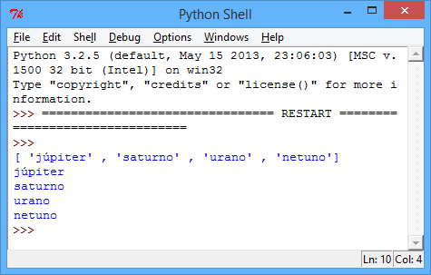
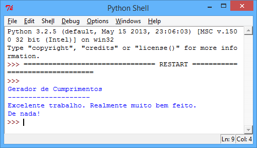
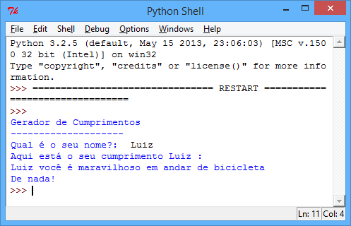
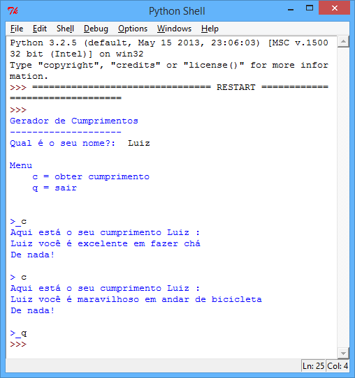
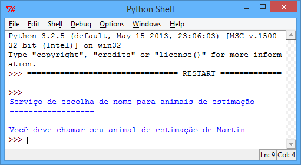

---
title: Gerador de Cumprimentos
level: Python 1
language: pt-BR
stylesheet: python
embeds: "*.png"
materials: ["Project Resources/*.*","Club Leader Resources/*.*"]
...

#Introdução:  { .intro}

Aprenda a usar listas para armazenar vários dados em 1 variável.

#Etapa 1: É legal ser legal { .activity}

Neste projeto, você vai fazer um programa que dá um cumprimento gerado aleatoriamente para o usuário!

## Lista de verificação da atividade { .check}

+ Em seus projetos, até agora você usou uma variável para armazenar um único dado, como um nome ou uma pontuação. Mas e se você quiser armazenar vários dados? Em Python, você pode usar uma _lista_ para armazenar vários dados em uma variável:

    ```python
    bigPlanets = [ "júpiter" , "saturno" , "urano" , "netuno"]
    ```

    Esta lista de texto também é conhecida como um _array_ de texto. Para acessar itens da lista, você só precisa saber a posição do item. Execute esse programa para ter uma ideia melhor de como as listas funcionam:

    ```python
    bigPlanets = [ "júpiter" , "saturno" , "urano" , "netuno"]
    print( bigPlanets )
    print( bigPlanets[0] )
    print( bigPlanets[1] )
    print( bigPlanets[2] )
    print( bigPlanets[3] )
    ```

    

    Como você pode ver, as posições começam em 0 e não em 1, então `bigPlanets[1]` é "saturno" (o segundo item) e não "júpiter".

+ Você pode usar uma lista chamada `cumprimentos` para armazenar todos os cumprimentos possíveis para o seu programa gerador de cumprimentos, e então usar `choice(cumprimentos)` para escolher um cumprimento aleatório para o usuário:

    ```python
    from random import *

    print("Gerador de Cumprimentos")
    print("--------------------")

    cumprimentos = [ "Excelente trabalho. Realmente muito bem feito." ,
                    "Suas habilidades de programação são muito, muito boas." ,
                    "Você é um humano excelente."
                  ]

    #imprime um item aleatório da lista 'cumprimentos'
    print(choice(cumprimentos))
    print("De nada!")
    ```

    

+ Você pode tornar seus cumprimentos um pouco mais interessantes combinando itens aleatórios de 2 listas diferentes:

    ```python
    from random import *

    print("Gerador de Cumprimentos")
    print("--------------------")

    adjetivos = [ "maravilhoso" , "acima da média" , "excelente" ]
    hobbies = [ "andar de bicicleta" , "programar" , "fazer chá" ]

    nome = input("Qual é o seu nome?: ")
    print( "Aqui está o seu cumprimento" , nome , ":" )

    #obtém um item aleatório de ambas as listas e adiciona-os ao cumprimento
    print( nome , "você é" , choice(adjetivos) , "em" , choice(hobbies) )
    print( "De nada!" )
    ```

    

## Salve seu projeto {.save}

## Desafio: Adicione mais cumprimentos { .challenge}
Tente pensar em mais cumprimentos e adicione-os ao seu programa! Lembre-se de que você precisa adicionar uma vírgula (`,`) entre os itens em suas listas.

## Salve seu projeto {.save}

#Etapa 2: Cumprimentos sem fim { .activity}

## Lista de verificação da atividade { .check}

+ Usando o que você sabe sobre laços `while` (enquanto) e instruções `if` (se), você pode modificar seu programa para continuar dando cumprimentos até que o usuário decida sair:

    ```python
    from random import *

    #o programa continua em execução enquanto a variável for verdadeira 'True'
    executa = True

    adjetivos = [ "maravilhoso" , "acima da média" , "excelente" ]
    hobbies = [ "andar de bicicleta" , "programar" , "fazer chá" ]

    print("Gerador de Cumprimentos")
    print("--------------------")

    nome = input("Qual é o seu nome?: ")

    print('''
    Menu
      c = obter cumprimento
      q = sair
    ''')

    while executa == True:

        menuChoice = input("\n>_").lower()

        #'c' para um cumprimento
        if menuChoice == 'c':

            print( "Aqui está o seu cumprimento" , nome , ":" )

            #obtém um item aleatório de ambas as listas e adiciona-os ao cumprimento
            print( nome , "você é" , choice(adjetivos) , "em" , choice(hobbies) )
            print( "De nada!" )

        #'q' para sair
        elif menuChoice == 'q':

            executa = False
            
        else:

            print("Escolha uma opção válida!")
    ```

    

    Lembre-se de que o laço `while` continua a ser executado enquanto a variável `executa` for verdadeira `True`. Se o usuário digitar `q` para sair, `executa` é definida como falsa `False`.

## Salve seu projeto {.save}

#Etapa 3: Personalização de cumprimentos { .activity}

## Lista de verificação da atividade { .check}

+ Seu gerador de cumprimentos está começando a ganhar forma, mas ele tem um problema: e se o usuário não souber andar de bicicleta ou fazer chá? Nesse caso, seus cumprimentos não serão verdadeiros e não vão animá-lo!

    Vamos modificar seu programa, de forma que o usuário possa escolher adicionar ou remover itens da lista de `hobbies`, para que ele possa personalizar os cumprimentos recebidos:

    ```python
    from random import *

    executa = True
    adjetivos = [ "maravilhoso" , "acima da média" , "excelente" ]
    hobbies = [ "andar de bicicleta" , "programar" , "fazer chá" ]

    print("Gerador de Cumprimentos")
    print("--------------------")

    nome = input("Qual é o seu nome?: ")

    print('''
    Menu
      c = obter cumprimento
      a = adicionar hobby
      d = remover hobby
      p = imprimir hobbies
      q = sair
    ''')

    while executa == True:

        menuChoice = input("\n>_").lower()

        #'c' para um cumprimento
        if menuChoice == 'c':

            print( "Aqui está o seu cumprimento" , nome , ":" )

            #obtém um item aleatório de ambas as listas e adiciona-os ao cumprimento
            print( nome , "você é" , choice(adjetivos) , "em" , choice(hobbies) )
            print( "De nada!" )

        #'a' para adicionar hobby
        elif menuChoice == 'a':

            itemToAdd = input("Adicione o hobby: ")
            hobbies.append(itemToAdd)

        #'d' para remover um hobby
        elif menuChoice == 'd':

            itemToDelete = input("Insira o hobby a ser removido: ")
            hobbies.remove(itemToDelete)

        #'p' para imprimir a lista de hobbies
        elif menuChoice == 'p':
            print(hobbies)

        #'q' para sair
        elif menuChoice == 'q':

            executa = False
            
        else:
            
            print("Insira uma opção válida!")
    ```

    Como você pode ver, você pode usar `append()` para adicionar a uma lista, e `remove()` para remover um item. Execute esse programa e personalize os hobbies na lista para que eles sirvam para você. Peça ao programa que cumprimente você até que fique de bom humor!

+ Quando testou o programa acima, você encontrou algum problema? No momento, seu gerador de cumprimentos para de funcionar se você tentar remover um cumprimento que não está na lista:

    

    Você pode consertar esse problema, primeiro verificando se o item a ser removido existe na lista. Substitua seu código para remover um hobby por este código:

    ```python
        #'d' para remover um hobby
        elif menuChoice == 'd':

            itemToDelete = input("Insira o hobby a ser removido: ")
            #só remove um item se ele estiver na lista
            if itemToDelete in hobbies:
            	hobbies.remove(itemToDelete)
            else:
            	print("O hobby não está na lista!")
    ```

    Agora, execute o programa e tente remover um hobby que não está na lista:

    

## Salve seu projeto {.save}

## Desafio: Duplicação de hobbies { .challenge}
Outro problema com o programa é que é possível adicionar o mesmo hobby mais de uma vez:


Você consegue resolver esse problema? Assim, um hobby só pode ser adicionado se ele ainda não estiver na lista:

```python
if itemToAdd not in hobbies:
	#adicione o código aqui...
```

## Salve seu projeto {.save}

## Desafio: Serviço de escolha de nome para animais de estimação { .challenge}
Escreva um programa para ajudar um novo dono a dar nome ao seu animal de estimação:



Seu programa pode:
+ permitir que o usuário adicione e remova itens da lista;
+ dar nomes diferentes para animais machos e fêmeas, ou para tipos diferentes de animais;
+ perguntar ao usuário quantos nomes eles precisam, caso eles tenham mais de um animal de estimação para dar nome.

## Salve seu projeto {.save}
