---
title: Minecraft 2D
level: Python 2
language: pt-BR
stylesheet: python
embeds: "*.png"
materials: ["Project Resources/*.*"]
...

# Introdução { .intro}

Neste projeto, você desenhará e fará melhorias no código de uma versão 2D do Minecraft.

# Passo 1: Jogando o jogo { .activity}

## Lista de Atividades { .check}

  + Execute o arquivo Minecraft2D.py e você verá uma tela que se parece com esta:

    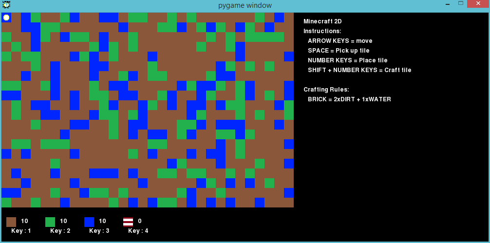

  + Seu personagem é o círculo amarelo que estará no alto e do lado esquerdo da sua tela de jogo! Use as setas para movê-lo pelo mundo, que, como você pode ver, é cheio de recursos diferentes: sujeira (os quadrados marrons), grama (os quadrados verdes) e água (os azuis).

  + Você pode pressionar a barra de espaço para coletar recursos. Por exemplo, se você mover para um quadrado de água e pressionar a barra de espaço, você verá que agora você tem mais água no seu estoque. Pegue um pouco de cada tipo de recurso.

    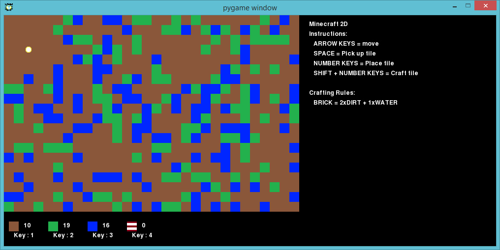

  + Pressione os números de 1 a 4 para colocar um recurso no mapa. Por exemplo, pressione 3 para colocar mais água no mapa. Isso só vai funcionar se você tiver água no seu estoque.

    

  + Você pode fabricar um item mantendo pressionada a tecla Shift e pressionando um número. Esse processo de fabricação significa que você combinará itens que você já tem em seu estoque para criar outros itens novos. Tente manter pressionada a tecla Shift e pressionar o número 4 para criar um novo tijolo (desde que você tenha 2 sujeiras e 1 água no seu estoque).

    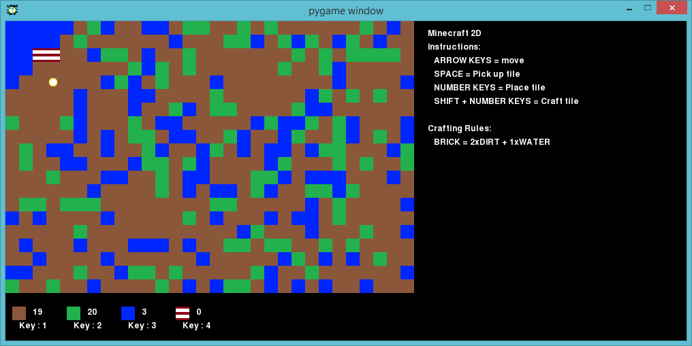

  + A medida em que você joga, você notará que você pode manter apenas um máximo de 20 unidades de cada recurso no seu estoque. Se você quiser aumentar este limite, você pode mudar o valor de uma variável chamada `MAXTILES` que está no arquivo variables.py.

    ```python
  	# a quantidade máxima de cada recurso que você pode manter no seu estoque
  	""" ---------------------------------------------------------------------

  	MAXTILES  = 20
    ```

    Mude este número e clique 2 vezes no arquivo Minecraft.py para armazenar uma quantia maior de cada recurso.

## Salve Seu Projeto {.save}

## Desafio: Construa seu mundo  { .challenge}

Brinque com o jogo e veja o que você consegue construir. Você consegue construir uma casa, com um jardim e um lago? Uma piscina? O que mais você consegue criar?

Aqui temos um exemplo simples:

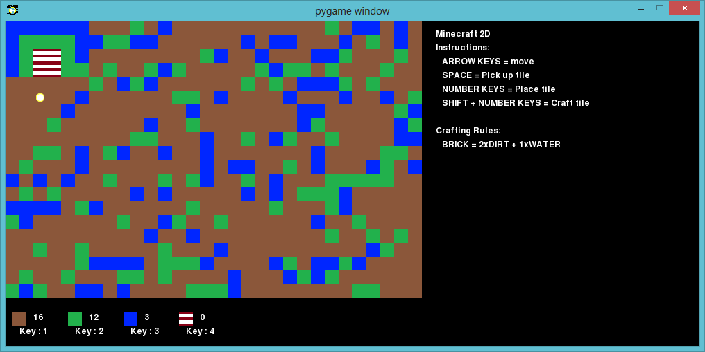

## Salve Seu Projeto {.save}

# Passo 2: Melhorando o visual { .activity}

Apenas ter blocos coloridos para cada recurso não é muito interessante, então vamos tentar mudar os gráficos de cada recurso.

## Lista de Atividades { .check}

  + Na pasta de Minecraft2D você verá que existem muitas imagens, uma para cada recurso. Se você clicar com o botão direito em uma dessas imagens e abrí-la no editor de imagem, você poderá mudar o gráfico de um recurso.

    Aqui temos alguns gráficos melhorados para a grama. Eu acrescentei diferentes tons de grama e até algumas flores:

    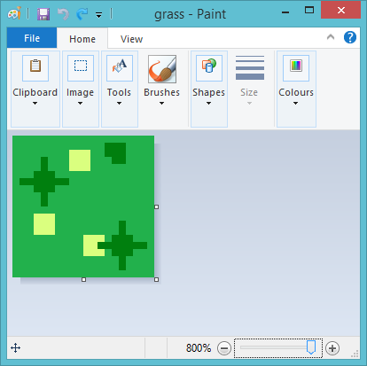

  + Salve a imagem e carregue novamente o jogo. Você verá o novo gráfico:

    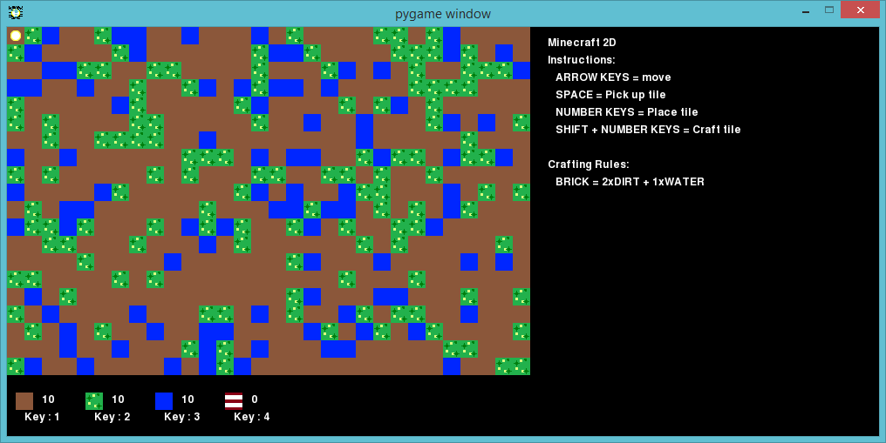

## Salve Seu Projeto {.save}

## Desafio: Melhorando o gráfico { .challenge}

Abra as imagens de sujeira, água e tijolo, e veja se você consegue melhorar o gráfico destes recursos.

## Salve Seu Projeto {.save}

## Desafio: Customizando o jogo { .challenge}

Abra o arquivo de variáveis variables.py e você encontrará alguns códigos para configurar a imagem e as legendas para a janela de jogo:

```python
# o texto da barra de título/imagem
# ----------------------------------

pygame.display.set_caption('pygame window')
pygame.display.set_icon(pygame.image.load('player.png'))
```

Edite estas 2 linhas de código para customizar o jogo. Lembre-se que se você mudar o ícone para um novo arquivo, você terá que criá-lo!

## Salve Seu Projeto {.save}

# Passo 3: Acrescentando novos recursos { .activity}

Você tem apenas 4 recursos no seu jogo: sujeria, grama, água e tijolo. Vamos acrescentar mais!

## Lista de Atividades { .check}

  + Vamos primeiramente criar um gráfico para um novo recurso chamado ‘madeira’. Você pode fazer uma cópia de uma imagem que já existe e renomeá-la. Você pode então editar uma imagem para que ela se pareça com madeira:

    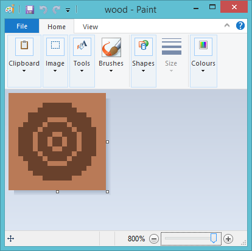

  + Quando você tiver sua imagem de madeira, você pode acrescentar este recurso ao seu jogo. Abra o arquivo variables.py e acrescente madeira como um recurso:

    ```python
    # variáveis representando os diferentes recursos
    # ----------------------------------------------

    DIRT  = 0
    GRASS = 1
    WATER = 2
    BRICK = 3
    WOOD  = 4

    ```

  + No mesmo arquivo, existe também uma lista de todos os recursos. Você deve acrescentar madeira a esta lista também:

    ```python
    # uma lista de todos os recursos de jogo
    # ---------------------------------------

    resources = [DIRT,GRASS,WATER,BRICK,WOOD]
    ```

  + Você também precisará configurar a imagem para o recurso madeira no dicionário de texturas, desta maneira o gráfico correto será mostrado:

    ```python
    # um dicionário ligando os recursos com as texturas
    # -------------------------------------------------

    textures =   {
                    DIRT    : pygame.image.load('dirt.png'),
                    GRASS   : pygame.image.load('grass.png'),
                    WATER   : pygame.image.load('water.png'),
                    BRICK   : pygame.image.load('brick.png'),
                    WOOD    : pygame.image.load('wood.png')
                 }
    ```

    Note que você precisa acrescentar uma vírgula (`,`) depois da imagem do tijolo na linha acima.

  + Você pode também acrescentar madeira ao dicionário do estoque. Você pode escolher com quantas unidades de madeira você inicia o jogo:

    ```python
    # A quantidade de cada recurso que você tem no início do jogo
    # -----------------------------------------------------------

    inventory =   {
                    DIRT    : 10,
                    GRASS   : 10,
                    WATER   : 10,
                    BRICK   : 0,
                    WOOD    : 5
                }
    ```

  + Se você rodar o jogo, você verá que agora você tem madeira e pode colocar no mapa, e você verá também que no início, ainda não existe nenhuma madeira no mapa:

    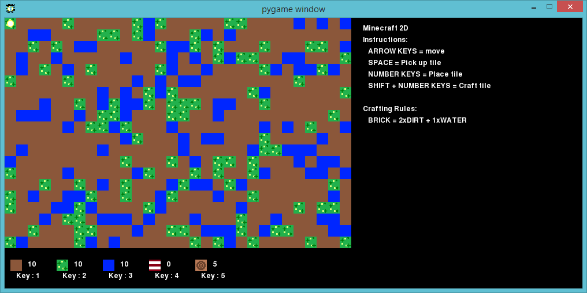

  + Para iniciar o jogo com alguma madeira, você precisa editar o arquivo Minecraft2D.py. Abra o arquivo e acrescenta as linhas abaixo:

    ```python
    # pegue um número aleatório entre 0 e 9 
    randomNumber = random.randint(0,10)
    # AGUA se o número aleatório for 1 ou 2
    if randomNumber in [1,2]:
        tile = WATER
    # GRAMA se o número aleatório for 3 ou 4
    elif randomNumber in [3,4]:
        tile = GRASS
    # ACRESCENTE ESSAS 2 LINHAS: MADEIRA se o número aleatório for 5
    elif randomNumber in [5]:
        tile = WOOD
    # caso contrário será SUJEIRA
    else:
        tile = DIRT
    ```

    Você sabe o que este código faz? Para cada espaço no mapa, o programa escolhe um número aleatório entre 0 e 9. Sempre que o número aleatório for 5, será colocada madeira no mapa. Depois que você acrescentar este código, você verá madeira no seu jogo:

    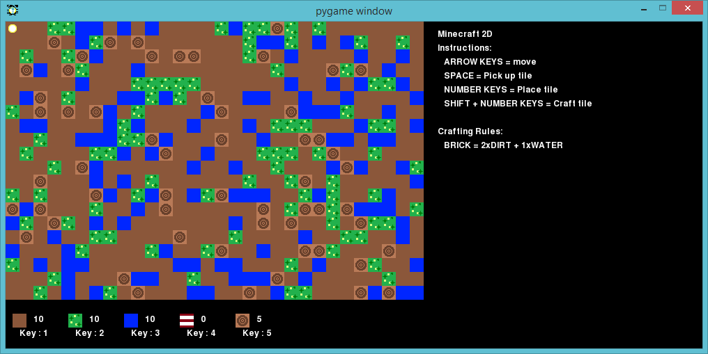

## Salve Seu Projeto {.save}

## Desafio: Acrescentado recursos { .challenge}

Use as instruções acima para acrescentar seus próprios recursos. Você pode acrescentar lava, metal, areia ou qualquer outra coisa que você conseguir imaginar!

## Salve Seu Projeto {.save}

# Passo 4: Criando novos recursos { .activity}

Você pode acrescentar mais recursos ao seu jogo que o jogador poderá ter apenas se ele os fabricar. Vamos criar um novo recurso chamado prancha. O jogador poderá combinar 3 unidades de madeira para fazer uma linda prancha brilhante!

## Lista de Atividades { .check}

  + Siga as instruções do Passo 3 acima para criar o novo recurso ‘prancha’. No entanto, garanta que não exista nenhuma prancha no estoque do jogador, e que não exista nenhuma prancha no mapa no início do jogo.

    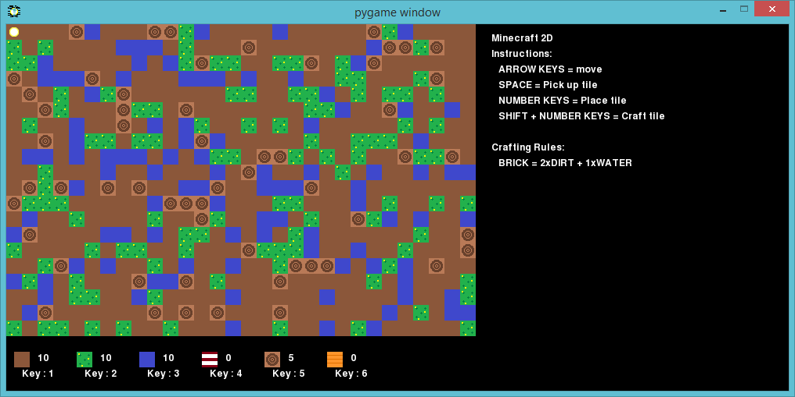

  + Para permitir que o jogador fabrique pranchas de madeira, você precisará adicionar uma regra de fabricação no seu jogo. Abra o arquivo variables.py e acrescente o seguinte código ao dicionário de regras de fabricação:

    ```python
    # regras para fabricar novos objetos
    # ----------------------------------

    craft = {
                BRICK    : { WATER : 1, DIRT : 2 },
                PLANK    : { WOOD : 3 }
            }
    ```

    Este código diz ao jogo que uma prancha pode ser criada se houver 3 madeiras no estoque do jogador. Não esqueça a vírgula depois da linha acima.

  + Você precisar garantir que o jogador saiba como fabricar pranchas, para isso adicione novas instruções à lista:

    ```python
    # lista de intruções
    # -----------------

    instructions =  [
                        "Minecraft 2D",
                        "Instructions:",
                        "   ARROW KEYS = move",
                        "   SPACE = Pick up tile",
                        "   NUMBER KEYS = Place tile",
                        "   SHIFT + NUMBER KEYS = Craft tile",
                        "",
                        "Crafting Rules:",
                        "   BRICK = 2xDIRT + 1xWATER",
                        "   PLANK = 3xWOOD"
                    ]
    ```

  + Se você coletar 3 madeiras e segurar a tecla shift e pressionar 6, você verá uma nova prancha no seu estoque. Após isto você poderá adicionar a prancha de madeira ao seu mapa!

    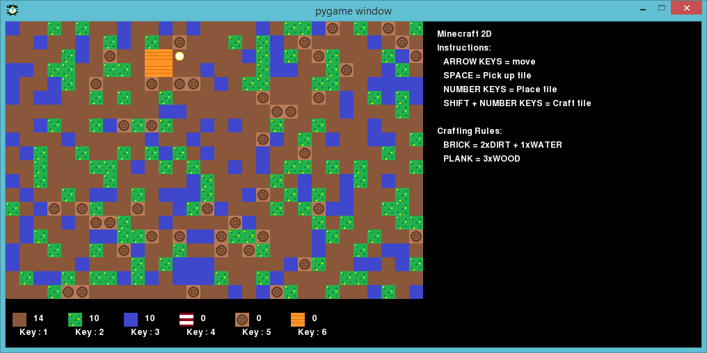

## Salve Seu Projeto {.save}

## Desafio: Desenvolva seu próprio jogo { .challenge}

Use o que você aprendeu para fabricar seus próprios recursos e sua próprias regras de fabricação. Por exemplo, você poderia criar regras de fabricação para produzir vidro (a partir de areia), diamante (a partir de vidro), ou árvores (a partir de madeira, água e sujeira).

## Salve Seu Projeto {.save}
