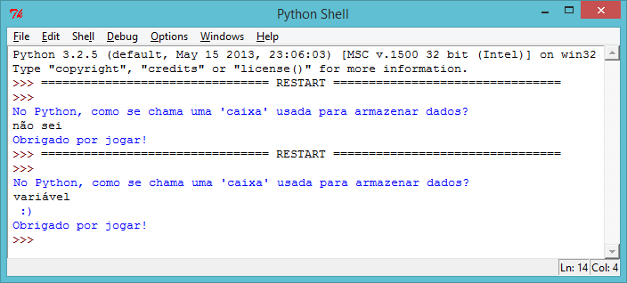
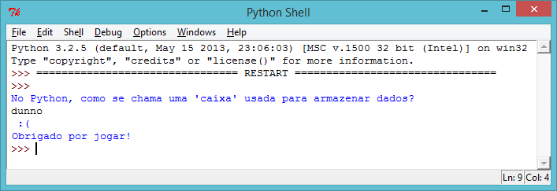
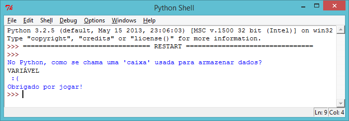
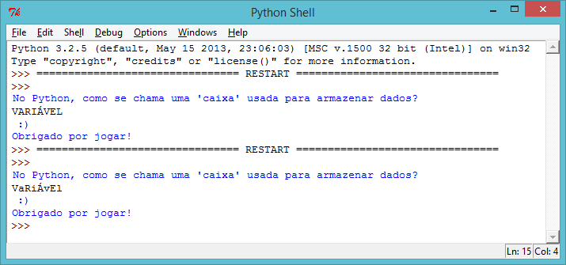
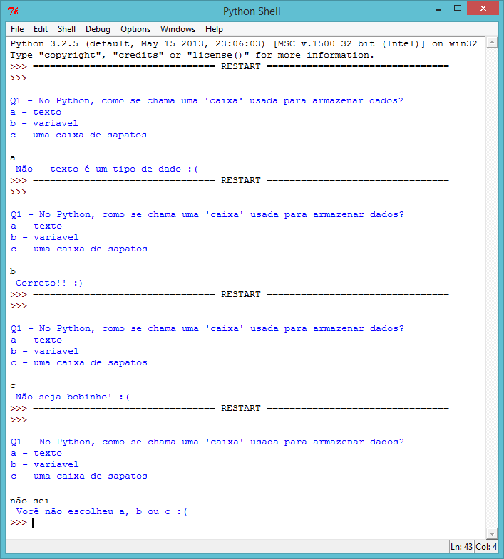

---
title: Quiz
level: Python 1
language: pt-BR
stylesheet: python
embeds: "*.png"
materials: ["Project Resources/Quiz.py"]
...

# Introdução:  { .intro}

Neste projeto, você irá fazer um quiz para desafiar seus amigos.

# Passo 1: Perguntando uma questão { .activity}

## Checklist da Atividade { .check}

+ Vamos começar escrever um programa de quiz muito simples que pergunta ao jogador a questão, e então mostra a ele uma face sorridente se ele escolher a alternativa correta.

	```python
	print("No Python, como se chama uma 'caixa' usada para armazenar dados?")
	resposta = input()

	if resposta == "variavel":
		print(" :) " * 100)

	print("Obrigado por jogar!")
	```

	Tome cuidado para adicionar os dois pontos (`:`) no final da linha `if resposta == "variavel":`, e recuar a linha abaixo dela (mover ela pra direita) com espaços.

+ Uma vez que você escreveu o programa acima, teste-o! O que acontece quando você acerta a resposta? O que acontece quando você a erra?

	

	O código recuado (que imprime os rostos sorridentes) é executado somente *if* resposta está correta. Mas "Obrigado por jogar!" sempre aparece, seja sua resposta certa ou errada. Por que?

	Python usa dois sinais de igual `==` para verificar se duas coisas são as mesmas. Isso ocorre porque um sinal de igual `=` é usado para armazenar algo em uma variável (por exemplo `reposta = input ()`).

+ O programa acima imprime rostos sorridentes se o jogador acerta a pergunta, mas não imprime nada para dizer-lhes que escreveram a resposta errada. Você pode usar uma declaração `else` para imprimir rostos tristes se o usuário insere outra coisa ao invés da resposta correta.

	```python
	print("No Python, como se chama uma 'caixa' usada para armazenar dados?")
	respostas = input()

	if resposta == "variavel":
		print(" :) " * 100)
	else:
		print(" :( " * 100)

	print("Obrigado por jogar!")
	```

	Experimente este novo programa. O que acontece quando você escreve a resposta certa? O que acontece quando você escreve qualquer outra coisa?

	

## Salve seu projeto {.save}

## Desafio: Questão de Tempo { .challenge}

Use o que você aprendeu para criar seu próprio quiz. Você pode escolher qualquer coisa que você goste, e seu quiz deve usar as instruções `if` e `else` para deixar que o jogador saiba o que ele está fazendo.

## Salve seu projeto {.save}

# Passo 2: Testando { .activity}

É sempre uma boa ideia testar seus programas, para ter certeza que eles funcionem corretamente.

## Checklist da Atividade { .check}

+ Se você testou seu quiz, você deve ter notado que é possível ver faces tristes mesmo que você tenha acertado a resposta! Como nesse exemplo, onde o jogador acidentalmente presSIONOU CAPS LOCK!

	

	Isso acontece porque o Python é muito rigoroso quando se compara a resposta do jogador com resposta correta. Para Python, "V" não é o mesmo que "v", e por isso, se o jogador usa todas as letras maiúsculas em sua resposta, Python acha que a resposta está errada!

	Teste isso em seu jogo, para ver se a mesma coisa acontece.

+ Para corrigir o problema, você precisa converter a entrada do jogador para letras minúsculas, de forma que não haja letras maiúsculas em sua resposta. Podemos ter certeza de que isso funciona, imprimindo a resposta modificada. Para fazer essa alteração, onde o jogador introduz a sua resposta:

	```python
	resposta = input().lower()
	print(resposta)
	```

+ Agora, teste o programa novamente. Você arrumou o problema? Tente testando estes exemplos:

	

## Salve seu projeto {.save}

# Passo 3: Multiplas escolhas { .activity}

## Checklist da Atividade { .check}

+ Até agora você usou `if` e `else` para permitir o jogador saber se ele acertou ou errou a resposta. Mas e se você quisesse fazer uma questão de múltipla escolha, onde o usuário pudesse ver uma de 4 mensagens? Você pode user `elif` para fazer isso.

	```python
	print('''
	Q1 - No Python, como se chama uma 'caixa' usada para armazenar dados?
	a - texto
	b - variavel
	c - uma caixa de sapatos
	''')
	resposta = input().lower()

	if resposta == "a":
		print(" Não - texto é um tipo de dado :( ")
	elif resposta == "b":
		print(" Correto!! :) ")
	elif resposta == "c":
		print(" Não seja bobinho! :( ")
	else:
		print(" Você não escolheu a, b ou c :( ")
	```

	`elif` é a abreviação de "else if". Então, no programa acima, o jogar vê uma de quatro mensagens, dependendo do que ele respondeu.

+ Adicione o código acima no seu quiz, de forma que você tenha uma questão de múltipla escolha.

+ Teste essa nova questão 4 vezes, para que você veja cada uma das 4 mensagens.

	

## Salve seu projeto {.save}

## Desafio: Quiz de múltipla escolha { .challenge}

Adicione algumas questões de múltipla escolha ao seu quiz. Uma vez que você tiver terminado de fazê-lo, ache alguém para jogar ele! Como eles fazem isso? Eles gostaram? Foi muito fácil ou muito difícil?

## Salve seu projeto {.save}

## Desafio: Mantendo a pontuação  { .challenge}

Você consegue usar uma variavel `score` no seu quiz, para medir o progresso da pontuação do jogador? A variável pode ser usada desta forma:

+ No começo do programa, deixe a pontuação em 0.
+ Sempre que uma pergunta é respondida corretamente, adicione 1 na pontuação do jogador. (`score = score + 1`)
+ Mostre a pontuação do jogador no final do quiz.

## Salve seu projeto {.save}

## Desafio: Como eu fiz?  { .challenge}

Você consegue exibir uma mensagem personalizada para o jogador no final do jogo?

+ Diga "muito bem!" `if` se ele acertou todas as respostas.
+ `else` diga "tente novamente" se ele errou alguma.

(Você precisará usar sua variável `score` para decidir qual mensagem exibir!)

## Salve seu projeto {.save}
