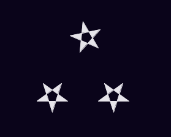
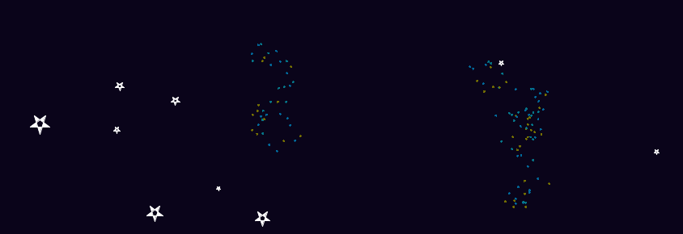
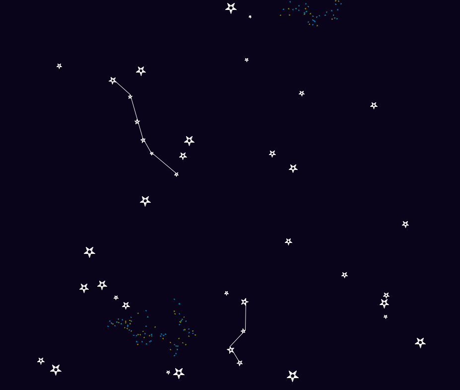
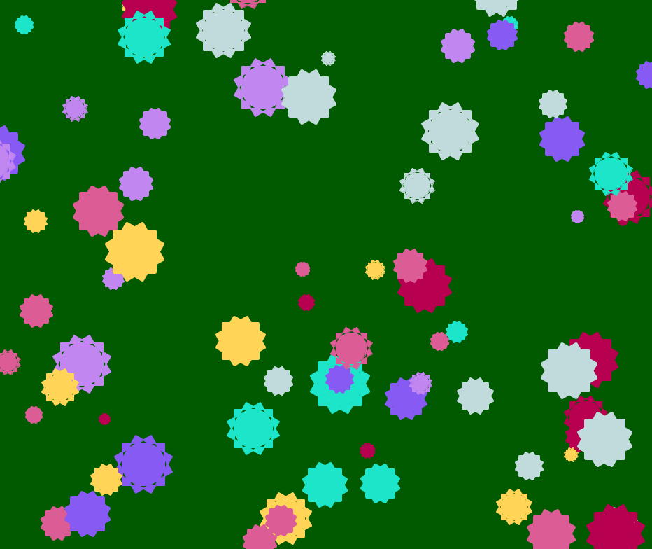
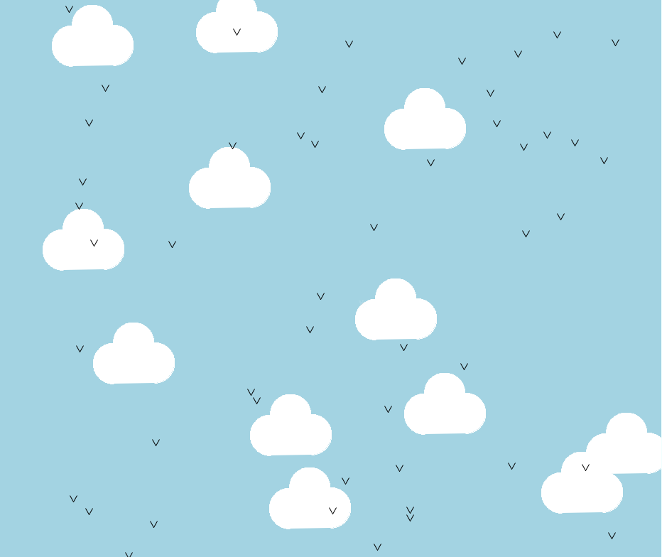

---
title: Ensinando com as Tartarugas
level: Python 2
language: pt-BR
stylesheet: python
embeds: "*.png"
materials: ["Project Resources/*.*","Club Leader Resources/*.*"]
...

#Introdução: { .intro}
Neste projeto, você vai aprender mais sobre desenhos com a tartaruga, e como _funções_ podem tornar a programação mais fácil.

#Etapa 1: Desenhando estrelas { .activity}

## Lista de atividade { .check}

+ Vamos começar usando o que você já sabe sobre tartarugas para desenhar uma estrela. Execute este programa, mas lembre-se de *não* chamá-lo de `turtle.py` - qualquer outro nome é permitido! 

	```python
	from turtle import *

	#isso vai desenhar uma estrela cinza clara em um fundo azul escuro
	color("WhiteSmoke")
	bgcolor("MidnightBlue")

	pendown()
	begin_fill()

	#desenha a forma da estrela
	for side in range(5):
	    left(144)
	    forward(50)

	end_fill()
	penup()

	forward(100)
	done()
	```

	

	Os únicos comandos novos aqui são `begin_fill()` e `end_fill()`. Esses comandos são usados para colorir uma forma. Observe também que não há nenhuma linha de caneta entre a estrela e a tartaruga na imagem acima, já que você usou a função `penup()` para fazer a tartaruga parar de desenhar.

	Além disso, você deve ter percebido o nome de algumas <a href="http://www.w3schools.com/html/html_colornames.asp">novas cores</a>! Você também pode usar códigos para cores em hexadecimal, da mesma forma que você fez na criação de páginas web.

+ Se você quiser desenhar 3 estrelas em posições diferentes na tela, então você pode definir sua própria função chamada `drawStar()`, e chamá-la 3 vezes:

	```python
	from turtle import *

	#uma função para desenhar uma estrela
	#'def' significa 'define'
	def drawStar():
		pendown()
		begin_fill()
		for side in range(5):
			left(144)
			forward(50)
		end_fill()
		penup()

	#isso vai desenhar uma estrela cinza clara em um fundo azul escuro
	color("WhiteSmoke")
	bgcolor("MidnightBlue")

	#use a função para desenhar estrelas!
	drawStar()
	forward(100)
	drawStar()
	left(120)
	forward(150)
	drawStar()

	hideturtle()
	done()
	```

	

	Você já viu e usou funções antes. Por exemplo, `penup()` e `pendown()` são funções. Quando usava essas funções, você não precisava saber exatamente como elas funcionavam, você podia simplesmente usá-las sempre que precisasse. 

	Sua nova função `drawStar()` funciona da mesma forma. Agora que você tem uma função para desenhar uma estrela, você não precisa se preocupar toda vez em como desenhar. Você pode simplesmente chamar a função e ela faz todo o trabalho por você!

## Salve seu projeto {.save}

## Desafio: Mais funções { .challenge}
Defina e use uma função para desenhar outra forma, como um quadrado ou um triângulo, ou qualquer outra coisa que você queira desenhar!

## Salve seu projeto {.save}

#Etapa 2: Passando dados para funções { .activity}

Agora você tem uma função para desenhar estrelas, mas e se você quisesse desenhar várias estrelas de tamanhos diferentes? Uma forma seria criar várias funções diferentes, como `drawBigStar()`, `drawMediumStar()` e `drawSmallStar()`.

Uma forma melhor é _passar dados_ para a sua função `drawStar()`, para informar qual tamanho você quer para a estrela! Você já usou várias funções que recebem dados antes, tais como:

```python
forward(100)
```
...que diz para a função `forward` para deslocar 100 pixels, e: 

```python
print("Olá")
```
...que diz para a função `print` para imprimir "Olá" na tela.

## Lista de atividade { .check}

+ Temos aqui um programa com uma função `drawStar()` que pode desenhar estrelas de tamanhos diferentes usando qualquer número passado para ela.

	```python
	from turtle import *

	#uma função para desenhar uma estrela de um tamanho específico
	def drawStar(starSize):
		pendown()
		begin_fill()
		for side in range(5):
			left(144)
			forward(starSize)
		end_fill()
		penup()

	#isso vai desenhar uma estrela cinza clara em um fundo azul escuro
	color("WhiteSmoke")
	bgcolor("MidnightBlue")

	#use a função para desenhar estrelas de tamanhos diferentes!
	drawStar(50)
	forward(100)
	drawStar(30)
	left(120)
	forward(150)
	drawStar(70)

	hideturtle()
	done()
	```

	

	Quando seu programa executa a linha `drawStar(50)`, o número `50` é passado para a função `drawStar()`, e então o valor de `starSize` é definido como `50`. Isso significa que a linha `forward(starSize)` desenha uma reta de 50 pixels de comprimento.

	

+ Você pode passar quantos dados quiser para a função `drawStar()`. Por exemplo, você também poderia passar a cor da estrela que você quer desenhar:

	```python
	from turtle import *

	#uma função para desenhar uma estrela de um tamanho específico
	def drawStar(starSize, starColour):
		color(starColour)
		pendown()
		begin_fill()
		for side in range(5):
			left(144)
			forward(starSize)
		end_fill()
		penup()

	#isso desenha um fundo azul escuro
	bgcolor("MidnightBlue")

	#use a função para desenhar estrelas de tamanhos diferentes!
	drawStar(50, "Red")
	forward(100)
	drawStar(30, "White")
	left(120)
	forward(150)
	drawStar(70, "Green")

	hideturtle()
	done()
	```

	

	Chamar a função `drawStar(50, "red")` funciona da mesma forma de antes, exceto que agora a primeira parte dos dados (`50`) se torna o valor de `starSize`, e a segunda parte (`"Red"`) se torna o valor de `starColour`.

## Salve seu projeto {.save}

## Desafio: Desenhando planetas { .challenge}
Crie uma função para desenhar um planeta chamada `drawPlanet()`. Passe dados para a função para que você possa especificar o tamanho e a cor do planeta que você quer desenhar.

## Salve seu projeto {.save}

#Etapa 3: Estrelas aleatórias { .activity}

Vamos usar a função `drawStar()` para desenhar estrelas de tamanhos diferentes aleatoriamente pela tela.

## Lista de atividade { .check}

+ Execute este programa, que move a tartaruga para uma nova posição, e então desenha uma estrela branca:

	```python
	from turtle import *

	#uma função para desenhar uma estrela de um tamanho específico
	def drawStar(starSize, starColour):
		color(starColour)
		pendown()
		begin_fill()
		for side in range(5):
			left(144)
			forward(starSize)
		end_fill()
		penup()

	#isso desenha um fundo azul escuro
	bgcolor("MidnightBlue")

	#vai para uma posição diferente (x=200,y=200)
	penup()
	setpos(200 , 200)
	pendown()

	#use a função para desenhar uma grande estrela branca
	drawStar(50, "White")

	hideturtle()
	done()
	```

	A função `setpos()` move a tartaruga para quaisquer coordenadas x e y passadas para ela. No programa acima, o código `setpos(200 , 200)` move a tartaruga para o ponto x=200, y=200 na tela. O que aconteceria se você mudasse os números passados para a função `setpos()`?

	

+ Você vai usar o código para se mover para uma posição aleatória muitas vezes, então vamos definir outra função chamada `moveToRandomLocation()`, a qual move a tartaruga para uma posição aleatória (obviamente)!

	```python
	from turtle import *
	from random import *

	#uma função para mover a tartaruga para uma posição aleatória
	def moveToRandomLocation():
		penup()
		setpos( randint(-400,400) , randint(-400,400) )
		pendown()

	#uma função para desenhar uma estrela de um tamanho específico
	def drawStar(starSize, starColour):
		color(starColour)
		pendown()
		begin_fill()
		for side in range(5):
			left(144)
			forward(starSize)
		end_fill()
		penup()

	#isso desenha um fundo azul escuro
	bgcolor("MidnightBlue")

	#desenha 30 estrelas brancas (tamanhos/posições aleatórias)
	for star in range(30):
		moveToRandomLocation()
		drawStar( randint(5,25) , "White")

	hideturtle()
	done()
	```

	

	Como você pode ver, este programa desenha 30 estrelas, indo cada vez para uma posição aleatória e desenhando uma estrela com um tamanho aleatório entre 5 e 25 pixels. Lembre-se de que o código `randint(5,25)` escolhe um número aleatório entre 5 e 25.

## Salve seu projeto {.save}

#Etapa 4: Funções dentro de funções { .activity}

Você pode escrever funções que usam outras funções, o que facilita ainda mais na hora de escrever programas maiores!

## Lista de atividade { .check}

+ Seria ótimo se pudéssemos adicionar uma galáxia de pequenas estrelas multicoloridas ao nosso desenho. Como já temos uma função para desenhar estrelas, podemos criar outra função chamada `drawGalaxy()` que usa a função `drawStar()` que já temos:

	```python
	from turtle import *
	from random import *

	#uma função para mover a tartaruga para uma posição aleatória
	def moveToRandomLocation():
		penup()
		setpos( randint(-400,400) , randint(-400,400) )
		pendown()

	#uma função para desenhar uma estrela de um tamanho específico
	def drawStar(starSize, starColour):
		color(starColour)
		pendown()
		begin_fill()
		for side in range(5):
			left(144)
			forward(starSize)
		end_fill()
		penup()

	#uma função para desenhar uma pequena galáxia de estrelas
	def drawGalaxy(numberOfStars):
		starColours = ["#058396","#0275A6","#827E01"]
		moveToRandomLocation()
		#desenha várias pequenas estrelas coloridas
		for star in range(numberOfStars):
			penup()
			left( randint(-180,180) )
			forward( randint(5,20) )
			pendown()
			#desenha uma pequena estrela de cor aleatória
			drawStar( 2, choice(starColours) )
	                
	speed(11)

	#isso desenha um fundo azul escuro
	bgcolor("MidnightBlue")

	#desenha 30 estrelas brancas (tamanhos/posições aleatórias)
	for star in range(30):
		moveToRandomLocation()
		drawStar( randint(5,25) , "White")

	#desenha 3 pequenas galáxias de 40 estrelas
	for galaxy in range(3):
		drawGalaxy(40)

	hideturtle()
	done()
	```

	

	Chamar `drawGalaxy(40)` 3 vezes significa que 3 galáxias são desenhadas, cada uma com 40 estrelas. Para cada galáxia, a função `drawStar()` é executada 40 vezes, com um pequeno movimento aleatório antes de desenhar uma estrela realmente pequena de cor aleatória.

	O código `speed(11)` também foi adicionado para deixar a tartaruga mais rápida!

+ Você também pode desenhar constelações feitas de estrelas ligadas por linhas brancas. Novamente, é muito fácil fazer isso porque você já tem a função que desenha estrelas!

	```python
	from turtle import *
	from random import *

	#uma função para mover a tartaruga para uma posição aleatória
	def moveToRandomLocation():
		penup()
		setpos( randint(-400,400) , randint(-400,400) )
		pendown()

	#uma função para desenhar uma estrela de um tamanho específico
	def drawStar(starSize, starColour):
		color(starColour)
		pendown()
		begin_fill()
		for side in range(5):
			left(144)
			forward(starSize)
		end_fill()
		penup()

	#uma função para desenhar uma pequena galáxia de estrelas
	def drawGalaxy(numberOfStars):
		starColours = ["#058396","#0275A6","#827E01"]
		moveToRandomLocation()
		#desenha várias pequenas estrelas coloridas
		for star in range(numberOfStars):
			penup()
			left( randint(-180,180) )
			forward( randint(5,20) )
			pendown()		
			#desenha uma pequena estrela de cor aleatória
			drawStar( 2, choice(starColours) )
	                
	#uma função para desenhar uma constelação de estrelas
	def drawConstellation(numberOfStars):
		moveToRandomLocation()
		#primeiro desenhamos todas as estrelas, exceto a última,
		#conectadas por linhas, assim: *--*--*--
		for star in range(numberOfStars-1):
			drawStar( randint(7,15) , "white")
			pendown()
			left( randint(-90,90) )
			forward( randint(30,70) )
		#agora desenhamos a última estrela
		drawStar( randint(7,15) , "White")

	speed(11)

	#isso desenha um fundo azul escuro
	bgcolor("MidnightBlue")

	#desenha 30 estrelas brancas (tamanhos/posições aleatórias)
	for star in range(30):
		moveToRandomLocation()
		drawStar( randint(5,25) , "White")

	#desenha 3 pequenas galáxias de 40 estrelas
	for galaxy in range(3):
		drawGalaxy(40)

	#desenha 2 constelações, cada uma com um número aleatório de estrelas
	for constellation in range(2):
		drawConstellation(randint(4,7))

	hideturtle()
	done()
	```

	

## Salve seu projeto {.save}

## Desafio: Funções em toda parte! { .challenge}
Programe a tartaruga para fazer seu próprio desenho. Tente usar funções sempre que possível, para desenhar quaisquer formas que você vai usar várias vezes.

Por exemplo, você poderia desenhar uma casa usando as funções `drawSquare()` e `drawTriangle()`.

Você poderia até passar dados para a sua função, para permitir que você desenhe formas de diferentes tamanhos e cores! Temos aqui alguns exemplos:




## Salve seu projeto {.save}