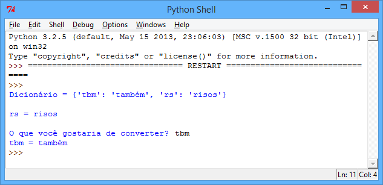
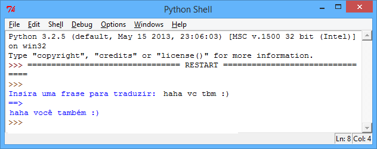
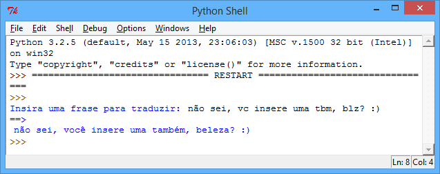
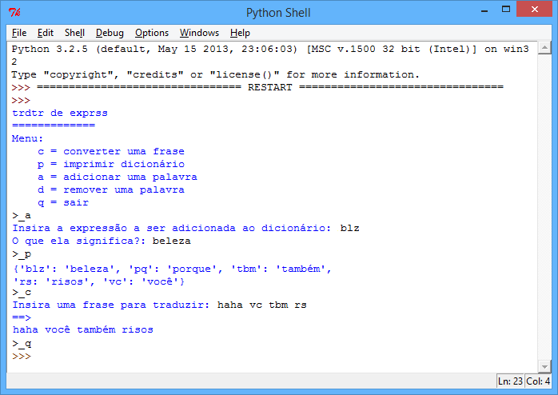
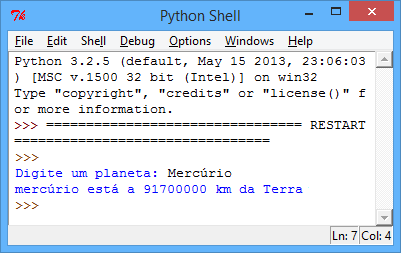
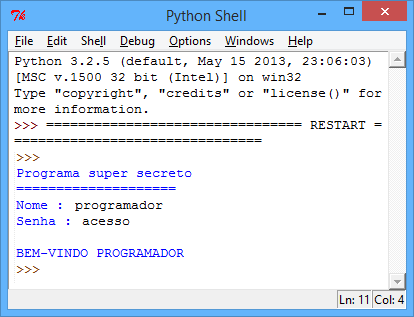

---
title: Conversor de expressões
level: Python 2
language: pt-BR
stylesheet: python
embeds: "*.png"
materials: ["Project Resources/*.*","Club Leader Resources/*.*"]
...

# Introdução:  { .intro}

Neste projeto, você vai aprender a criar um programa para traduzir expressões em frases.

# Etapa 1: Traduzindo palavras { .activity}

Vamos fazer um programa para converter expressões para o português.

## Lista de atividade { .check}

+ Como você provavelmente sabe, um dicionário serve para que você procure por uma palavra e encontre seu significado. Em Python, um dicionário é ainda mais flexível que isso - ele permite que você mapeie qualquer coisa (que chamamos chave, ou _key_) para qualquer outra coisa! Temos aqui um dicionário que relaciona expressões a seus significados:

    ```python
    textSpeakDictionary = {
        "rs"   : "risos" ,
        "tmb"   : "também"
    }
    ```

    Assim, no dicionário acima, a chave "rs" se relaciona ao texto "risos", e a chave "tmb" ao texto "também". Você deve usar o sinal de dois pontos (`:`) para mapear as chaves das expressões a seus significados, e colocar uma vírgula entre cada item do dicionário.

+ Obter informações do dicionário é fácil; você só precisa adicionar a chave depois do nome da variável que representa o dicionário, entre colchetes. Temos aqui um pequeno programa que mostra como isso funciona:

    ```python
    textSpeakDictionary = {
        "rs"   : "risos" ,
        "tmb"   : "também"
    }

    #imprime o dicionário inteiro
    print( "Dicionário =" , textSpeakDictionary )

    #imprime apenas o conteúdo relacionado à chave "rs"
    print( "\nrs =" , textSpeakDictionary["rs"] )

    #texto que pede a entrada do usuário
    key = input("\nO que você gostaria de converter? : ")
    print( key , "=" , textSpeakDictionary[key] )
    ```

    

    Este programa imprime 3 coisas: o dicionário inteiro, o conteúdo relacionado à chave "rs" e por fim a mensagem do dicionário para qualquer entrada do usuário.

## Salve seu projeto {.save}

#Etapa 2: Traduzindo frases { .activity}

Vamos melhorar nosso programa, assim você pode traduzir frases inteiras ao invés de uma única palavra.

## Lista de atividade { .check}

+ Execute este programa, que ajuda a dividir uma frase em palavras individuais, e depois traduza cada palavra (se ela existir no dicionário):

    ```python
    textSpeakDictionary = {
        "rs"   : "risos" ,
        "tmb"   : "também"
    }

    #obtém a frase para tradução
    sentence = input("Insira uma frase para traduzir: ").lower()

    #divide a frase em uma lista de palavras
    wordsToTranslate = sentence.split()

    translatedSentence = ""

    #passa por cada palavra da lista
    for word in wordsToTranslate:

    	#adiciona a palavra traduzida caso ela exista no dicionário
        if word in textSpeakDictionary:

            translatedSentence += textSpeakDictionary[word] + " "

        #mantém a palavra original caso não exista tradução
        else:

            translatedSentence += word + " "

    #imprime a frase traduzida
    print("==>")
    print(translatedSentence)
    ```

    

    O programa pega uma palavra de cada vez e verifica se ela está no dicionário. Se estiver, então o texto traduzido é adicionado à variável `translatedSentence`, que é exibida no final do programa. Se a palavra não estiver no dicionário, então apenas a palavra original é adicionada à variável `translatedSentence`.

    Observe que sempre uma palavra é adicionada à `translatedSentence`, um espaço também é adicionado (` + " "`). O que você acha que aconteceria se esse espaço não fosse adicionado?

## Desafio: Adicionando traduções { .challenge}
+ Adicione mais algumas traduções ao programa acima. Por exemplo:
	
	+ "vc" = "você"
	+ "pq" = "porque"

Você deve pesquisar algumas expressões caso não conheça nenhuma.

+ Experimente o programa acima, com um número diferente de frases, para ver se ele funciona.



+ Você ou seus amigos fizeram alguma coisa para travar o programa? Se sim, você consegue resolver o problema?

# Etapa 3: Adição e remoção de traduções { .activity}
## Lista de atividade { .check}

+ Assim como o seu programa 'gerador de cumprimentos', seria legal permitir que o usuário adicione e remova palavras do dicionário. Você pode fazer isso criando um menu:

    ```python
    def displayMenu():
        print("trdtr de exprss")
        print("=" * 13)
        print("Menu:")
        print("  c = converter uma frase")
        print("  p = imprimir dicionário")
        print("  a = adicionar uma palavra")
        print("  d = remover uma palavra")
        print("  q = sair")

    #-------------------------------------------------------

    def convertSentence():
        sentence = input("Insira uma frase para traduzir: ").lower()
        translatedSentence = ""

        #divide a frase em uma lista de palavras
        listOfWords = sentence.split()

        for word in listOfWords:
            #adiciona a palavra traduzida se ela existir no dicionário
            if word in textSpeakDictionary:

                translatedSentence += textSpeakDictionary[word] + " "

            #mantém a palavra original caso não exista tradução
            else:

                translatedSentence += word + " "

        #imprime a frase traduzida
        print("==>")
        print(translatedSentence)  

    #-------------------------------------------------------

    def addDictionaryItem():
        txtToAdd = input("Insira a expressão a ser adicionada ao dicionário: ")
        meaning = input("O que ela significa?: ")
        #adiciona a nova tradução ao dicionário
        textSpeakDictionary[txtToAdd] = meaning

    #-------------------------------------------------------

    def deleteDictionaryItem():
        txtToDelete = input("Insira a expressão a ser removida ao dicionário: ")
        #remove a tradução do dicionário
        del textSpeakDictionary[txtToDelete]

    #-------------------------------------------------------
    # o programa principal começa aqui!
    #-------------------------------------------------------

    textSpeakDictionary = {
        "rs"  : "risos" ,
        "tmb"  : "também" ,
        "vc"   : "você" ,
        "pq"   : "porque"
    }

    running = True

    displayMenu()

    #repete até que o usuário digite 'q' para sair
    while running == True:
        
        menuChoice = input(">_").lower()

        #c para converter
        if menuChoice == 'c':
            convertSentence()
            
        #p para imprimir
        elif menuChoice == 'p':
            print(textSpeakDictionary)

        #a para adicionar
        elif menuChoice == 'a':
            addDictionaryItem()

        #d para remover
        elif menuChoice == 'd':
            deleteDictionaryItem()

        #q para sair
        elif menuChoice == 'q':
            running = False

        else:
            print("Escolha inválida!")
    ```

    

    Apesar de esse programa ser loooongo, você já viu a maior parte desse código em outros programas. Os novos trechos são apenas o código para adicionar um item ao dicionário.

    ```python
    txtToAdd = input("Insira a expressão a ser adicionada ao dicionário: ")
    meaning = input("O que ela significa?: ")
    #adiciona a nova tradução ao dicionário
    textSpeakDictionary[txtToAdd] = meaning
    ```

    ...e o código para remover um item:

    ```python
    txtToDelete = input("Insira a expressão a ser removida ao dicionário: ")
    #remove a tradução do dicionário
    del textSpeakDictionary[txtToDelete]
    ```

    O código para cada uma das opções do menu também está em sua própria função, para tornar o código mais fácil de ler.

## Salve seu projeto {.save}

## Desafio: Testando seu programa { .challenge}
Execute seu programa e tente adicionar uma palavra que já existe no dicionário. O que acontece? O que acontece quando você tenta remover algo que não está no dicionário? Você pode melhorar seu programa para que:

+ você só possa adicionar chaves que ainda não existem?

```python
if itemToAdd not in textSpeakDictionary:
	#Adicione seu código aqui!
```

+ você só possa remover chaves se elas já existirem no dicionário?

```python
if itemToDelete not in textSpeakDictionary:
	#Adicione seu código aqui!
```

## Salve seu projeto {.save}

# Etapa 4: Arrumando seu programa { .activity}
## Lista de atividade { .check}

+ Você já fez vários testes para melhorar seu programa, mas ainda há uma coisa que você pode arrumar para deixar seu programa ainda melhor. Veja o que acontece quando você testa seu programa com a seguinte frase:

    

    Ela não é traduzida corretamente. Experimente você mesmo.

+ Por que seu programa não converte a expressão 'rs' dessa frase? É porque seu programa divide a frase em palavras, assim:

    ```python
    words = [ "oi" , "rs!" ]
    ```

    Então, ele procura pela chave `"rs!"` em seu dicionário (com o ponto de exclamação), e não encontra tradução alguma, porque `"rs!"` não existe! Uma forma simples de evitar esse problema é remover a pontuação da frase antes de traduzi-la. Adicione esse código à função `convertSentence()`:

    ```python
    def convertSentence():
        sentence = input("Insira uma frase para traduzir: ").lower()
        translatedSentence = ""

        #remove a pontuação da frase
        for char in '?!.,':
        	sentence = sentence.replace(char,'') 

        #divide a frase em uma lista de palavras
        listOfWords = sentence.split()
        ...
    ```

    Esse código extra passa por cada ponto `?!.,` e os substitui na frase por... nada! Ele remove a pontuação da frase.

+ Depois de adicionar esse código para remover a pontuação, tente traduzir `"oi, rs!"` novamente, para verificar se o problema foi resolvido.

## Desafio: Planetas distantes { .challenge}
Faça um programa para dar informações ao usuário sobre o tópico que você quiser. Por exemplo: planetas e suas distâncias da Terra. Você pode armazenar esses dados em um dicionário que liga planetas e distâncias. 



## Salve seu projeto {.save}

## Desafio: Proteção de senha { .challenge}
Crie um programa de proteção de senha, que pede que o usuário informe seu nome e senha e verifica se os dados estão corretos em um dicionário. 



Seu programa precisa verificar se o nome do usuário existe no dicionário _e_ se a senha para esse usuário foi fornecida. Você pode usar esse código como guia:

```python
# verifica se o nome existe e se a senha está correta
if name in passwordDictionary and password == passwordDictionary[name]:
	#adicione o código aqui!
```

Verifique se seu programa funciona testando o que acontece quando o usuário entra com nomes e senhas válidos e inválidos.

Se quiser, você também pode:

+ adicionar esse código de login a um dos programas que você já criou, assim ele só poderá ser usado por seus amigos.

+ permitir apenas 3 tentativas de login..., somando 1 a `loginAttempts` sempre que um acesso for negado.

```python
loginAttempts = 0
while loginAttempts < 3:
    #insira o código do login aqui!
```

+ Você pode usar até o que você aprendeu sobre dicionários para criar um programa para armazenar os endereços de e-mail dos seus amigos, ou traduzir um texto de um idioma para outro. Você pode até criar uma proteção de senha para que esse programa seja seguro!

## Salve seu projeto {.save}
